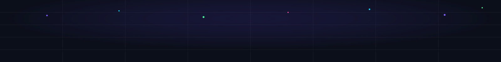

  <!-- Header Banner -->
  

    

  <!-- Dynamic Animated Typing -->
  

---

# 👨‍💻 About Me

### 🚀 AI Enthusiast | Machine Learning Developer | SDE Aspirant

I'm deeply passionate about **Artificial Intelligence and Machine Learning**, driven by a desire to build intelligent, production-ready systems that solve real-world problems.

- ⚡ **Problem Solving**: Solving **Data Structures & Algorithms in C++**
- 🧠 **Machine Learning**: Building ML models with **Python, Scikit-Learn, Pandas & NumPy**
- 🌐 **Web Backend**: Developing backend APIs using **Django & FastAPI**
- 🚀 **Next Frontiers**: Exploring **Deep Learning, NLP, OpenCV, LLMs, RAG & Agentic AI**
- 🎯 **Career Goal**: Become an **AI/ML Engineer & SDE** who bridges complex models with high-performance software.

 

---

# 🛠️ Tech Stack & Ecosystem

  

  
  
  
  
  
  

---

# 🚀 Current Focus & Learning Journey

  
  &nbsp;
  

  
  &nbsp;
  

  

---

# 🐍 Contribution Activity

  

  <picture>
    <source media="(prefers-color-scheme: dark)" srcset="https://raw.githubusercontent.com/nithishkumarchirukuripati21-ops/nithishkumarchirukuripati21-ops/output/github-contribution-grid-snake-dark.svg">
    <source media="(prefers-color-scheme: light)" srcset="https://raw.githubusercontent.com/nithishkumarchirukuripati21-ops/nithishkumarchirukuripati21-ops/output/github-contribution-grid-snake.svg">
    
  </picture>

---

# 📫 Connect With Me

  
  &nbsp;&nbsp;&nbsp;
  
  &nbsp;&nbsp;&nbsp;
  

 

  

